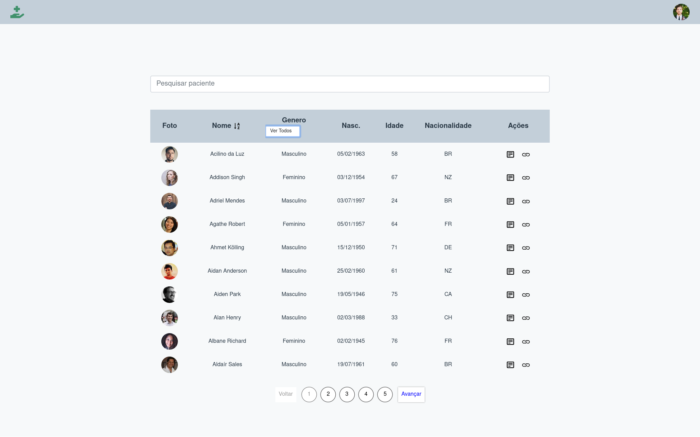

# Bem Vindo ao Desafio Frontend Coodesh

## Projeto desenvolvido com React + Styled Components + randomuser.me API

https://mymoviedb-app.netlify.app/

## 🏁 Tecnologias utilizadas

- React
- React Router Dom
- Context API
- Styled-components
- Reactstrap
- React Icons
- Fuse JS

## 🛠 Instruções de Instalação

1. Clone o repositorio

`https://github.com/marcusjava/coodesh_frontend`

2. Usando docker

- Construir imagem: docker build -t nome .
- Testando imagem: docker run -p 80:80 noma_imagem
- Abra o navegador e digite http://localhost

3. Instalação
   Pré-requisitos: NodeJS instalado `https://nodejs.org/en/`

- Instalar dependencias - `yarn install`
- Iniciar projeto - `yarn start`
